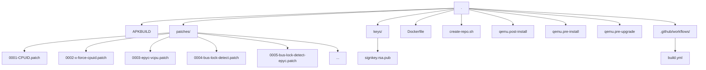

# QEMU Alpine Package Repository

This repository automatically builds custom Alpine Linux packages for QEMU with additional patches and optimizations for x86_64 virtualization.

## Overview

- **Purpose**: Custom QEMU builds with enhanced CPUID support, EPYC vCPU optimizations, and bus lock detection patches
- **Build System**: Automated via GitHub Actions
- **Signing**: Packages are signed with a private key stored in GitHub Secrets

## Repository Structure



## Features

### Custom Patches

- **Extended CPU Topology (Fn80000026)**: CPUID support for extended CPU topology enumeration
- **EPYC vCPU Optimizations**: AMD EPYC-specific virtualization improvements
- **Bus Lock Detection**: Enhanced bus lock detection for virtualization security
- **Musl/liburing Compatibility**: Fixes for Alpine's musl libc and modern liburing

### Build Configuration

The package is built with:
- KVM acceleration enabled
- Seccomp sandboxing
- VirtFS/9p support
- Vhost-net, VDE networking
- TPM support
- Zstd, Snappy, LZO compression

## Adding the Repository

### 1. Import the signing key

Download the public key directly from the repository and install it into Alpine's trusted keys directory:

```bash
wget -O /etc/apk/keys/signkey.rsa.pub https://glemsom.github.io/dkvm-qemu/x86_64/signkey.rsa.pub
```

Alternatively, if you have cloned this repository locally:

```bash
cp keys/signkey.rsa.pub /etc/apk/keys/
```

### 2. Add the repository URL

Add the repository to `/etc/apk/repositories`:

```bash
echo "https://glemsom.github.io/dkvm-qemu/x86_64" >> /etc/apk/repositories
```

### 3. Install packages

Update the package index and install the desired packages:

```bash
apk update
apk add qemu qemu-system-x86_64
```

## CI/CD

This repository uses GitHub Actions to automatically build and publish packages:

- **Triggers**: Push to main branch (when Dockerfile, APKBUILD, or patches change) or manual dispatch
- **Build**: Packages are built in a Docker container with Alpine 3.23
- **Sign**: Packages are signed using the private key stored in `SIGNING_PRIVATE_KEY` secret
- **Publish**: The signed repository is published to GitHub Pages

### Required Secrets

- `SIGNING_PRIVATE_KEY`: RSA private key matching `keys/signkey.rsa.pub`

## Files Reference

| File | Description |
|------|-------------|
| `APKBUILD` | Alpine package build recipe |
| `create-repo.sh` | Creates signed APKINDEX.tar.gz |
| `Dockerfile` | Alpine-based build environment |
| `.github/workflows/build.yml` | GitHub Actions CI/CD pipeline |
| `patches/*.patch` | QEMU source patches |
| `keys/signkey.rsa.pub` | Public key for package verification |