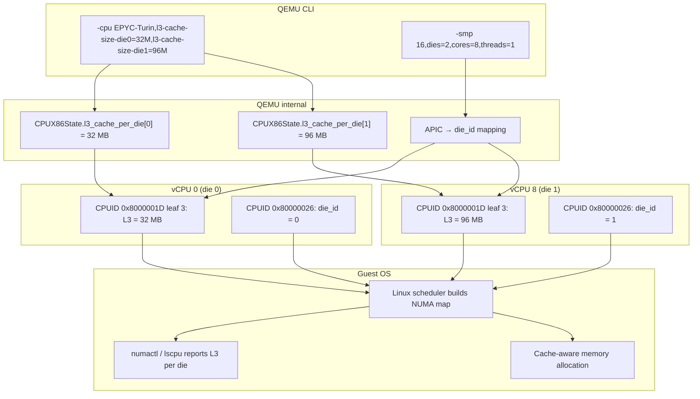

# AMD Die Topology & 3D V-Cache

This document explains AMD's chiplet architecture, the role of L3 cache, how 3D V-Cache creates asymmetric die topologies, and why QEMU/KVM must reflect this asymmetry for correct guest behaviour.

## What is a die (CCD)?

AMD's modern server and high-end desktop CPUs (EPYC, Ryzen Threadripper, Ryzen X3D) are built from **chiplets** — small silicon dies packaged together on a single substrate. The compute chiplets are called **Core Complex Dies (CCDs)**.

Each CCD contains:

- One **Core Complex (CCX)** — a cluster of up to 8 CPU cores
- A shared **L3 cache** accessible by every core in that CCD
- Private L1 and L2 caches per core (not shared between dies)

A single processor package may contain 1, 2, 4, 8, or more CCDs. The OS and firmware see each CCD as a **die** — a topology container that groups cores sharing a unified L3 cache instance.

```
┌─────────────────────────────────────┐
│        AMD CPU Package              │
├─────────────────┬───────────────────┤
│    CCD (Die 0)  │    CCD (Die 1)    │
│  ┌─────┐ ┌────┐ │  ┌─────┐ ┌────┐  │
│  │Core0│ │Core1│ │  │Core0│ │Core1│  │
│  │L1+L2│ │L1+L2│ │  │L1+L2│ │L1+L2│  │
│  └──┬──┘ └──┬──┘ │  └──┬──┘ └──┬──┘  │
│     └──┬───┘     │     └──┬───┘      │
│     ┌──┴──┐      │     ┌──┴──┐       │
│     │ L3  │      │     │ L3  │       │
│     │ 32MB│      │     │ 32MB│       │
│     └─────┘      │     └─────┘       │
└─────────────────┴─────────────────────┘
```

## What is L3 cache and why does it matter?

L3 cache is the **last-level cache (LLC)** in the AMD cache hierarchy:

| Level | Size | Per | Latency | Purpose |
|-------|------|-----|---------|---------|
| L1    | 32 KB | core | ~1 ns | Fastest, instruction + data split |
| L2    | 1 MB | core | ~3 ns | Mid-level, unified |
| L3    | 32–96 MB | die | ~10–15 ns | Shared LLC, cache coherence |

Key properties of L3:

- **Shared within a die** — all cores in a die access the same L3 instance
- **Not shared between dies** — cross-die cache misses must go through the inter-die interconnect (Infinity Fabric)
- **Inclusive on some models** — may contain copies of L1/L2 lines (simplifies coherence)
- **Critical for NUMA topology** — the OS scheduler uses L3 sharing to decide thread placement

A core accessing data in its local die's L3 is significantly faster than fetching from another die's L3 or from DRAM. This is why topology-aware scheduling matters.

## What is 3D V-Cache?

3D V-Cache is AMD's technology for stacking an additional L3 cache die vertically on top of a CCD, connected through hybrid bonding (through-silicon vias, TSVs).

### How it works

A standard Zen 5 CCD has **32 MB of L3 cache**. The 3D V-Cache variant adds a **64 MB SRAM stack** on top of the existing L3, bringing the total to **96 MB** for that die.

```
Standard CCD                    3D V-Cache CCD
┌──────────────┐                ┌──────────────┐
│   8 cores    │                │   8 cores    │
│  (L1 + L2)   │                │  (L1 + L2)   │
├──────────────┤                ├──────────────┤
│   L3 32 MB   │                │   L3 32 MB   │
└──────────────┘                │━━━━━━━━━━━━━━│ ← Hybrid bond
                                │ V-Cache 64 MB│
                                ├──────────────┤
                                │L3 total 96 MB│
                                └──────────────┘
```

### Why only one die?

Stacking 3D V-Cache adds cost, complexity, and thermal challenges. On asymmetric parts like the **Ryzen 9 9950X3D**:

- **Die 0**: 32 MB L3 (standard CCD)
- **Die 1**: 96 MB L3 (3D V-Cache CCD)

The result is a **two-die system where dies have different L3 capacities**.

## Why symmetric L3 reporting is wrong for 9950X3D

Standard QEMU/KVM CPU topology models assign a **single uniform L3 cache size** to every vCPU. When a guest queries L3 cache topology via CPUID, every vCPU gets the same answer.

On a 9950X3D host (or a VM that wants to simulate one), this uniform reporting is incorrect:

| Property | Real hardware | Standard QEMU | DKVM QEMU |
|----------|---------------|---------------|-----------|
| Die 0 L3 | 32 MB | 96 MB (or whatever) | 32 MB |
| Die 1 L3 | 96 MB | 96 MB (same) | 96 MB |
| vCPU 0-7 L3 size | 32 MB | uniform | matches die |
| vCPU 8-15 L3 size | 96 MB | uniform | matches die |

A uniform offset — if you set the model's L3 to 32 MB, you lose the 96 MB die; if you set it to 96 MB, you over-report the 32 MB die.

The DKVM QEMU patches add per-die L3 properties (`l3-cache-size-die0=32M,l3-cache-size-die1=96M`) so that each vCPU reports the cache size of its actual die.

## What the guest OS does with this info

Linux uses cache topology information for several performance-critical decisions:

### NUMA balancing

Linux treats each L3 cache domain as a **NUMA node** when `CONFIG_NUMA` is enabled. The scheduler places threads and their memory on the same die to minimise cross-die traffic. Correct per-die L3 reporting means the kernel can distinguish the 32 MB die from the 96 MB die.

### Cache-aware memory allocation

The `lscpu -C` and `sysfs` entries under `/sys/devices/system/cpu/cpu*/cache/index3/` report the L3 size per vCPU. Runtime optimisers, JIT compilers, and container orchestrators use this to tune working-set sizes.

### Topology-aware scheduling

`numactl`, `taskset`, and the kernel's `sched_balance` use topology maps built from cache-sharing information. When two threads share an L3, the scheduler keeps them on the same die for low-latency data sharing.

### Real-world impact

A NUMA-unaware workload pinned across both dies without correct topology information may:

- Suffer cross-die latency spikes
- Mis-size data structures (too small for the big L3, or too large for the small L3)
- Get sub-optimal memory allocation

## Relationship to CPUID leaves

The per-die L3 asymmetry is reported through two CPUID leaves working together:

### Leaf 0x80000026 — Die topology

Introduced by AMD in Zen 4, this leaf exposes die-level topology. It reports:

- `EBX[23:16]` — number of dies per processor
- `ECX[15:0]` — die ID of the current thread (derived from APIC ID)

This leaf tells the OS how many dies exist and which die the querying vCPU belongs to. It is the **die topology discovery mechanism**.

### Leaf 0x8000001D — Cache topology (per die)

AMD's cache topology leaf enumerates each cache level. For L3 (level 3, EAX=0x8000001D leaf index 3):

- `EAX` — cache type, share topology level, core count per cache
- `EBX` — line size, physical line partitions, associativity
- `ECX` — number of sets
- **Size = line_size × associativity × partitions × sets**

The `share topology level` field in `EAX` is set to `die` for L3, meaning all cores within the die share this cache. The OS is expected to:

1. Call `0x80000026` to determine die topology
2. Call `0x8000001D` leaf 3 to discover L3 geometry
3. Map die ID ↔ L3 parameters to build the NUMA topology

### How DKVM QEMU changes this

In unmodified QEMU, all vCPUs see the same L3 cache info from `0x8000001D`. DKVM QEMU's patches intercept the L3 encode path for leaves `0x8000001D` (leaf 3), `0x80000006` (EDX), and CPUID leaf 4, and substitute the per-die `CPUCacheInfo` struct stored on `CPUX86State.l3_cache_per_die[]`. The die ID is extracted from the vCPU's APIC ID via `x86_topo_ids_from_apicid()`, matching the die reporting from leaf `0x80000026`.

## Visual summary: full topology flow



The diagram shows the flow from CLI configuration through internal data structures to per-vCPU CPUID encoding and finally guest OS consumption.

## Further reading

- [Domain Glossary](../reference/glossary.md) — terminology and design decisions
- [Architecture Decision Record](../adr/0001-per-die-asymmetric-l3-cache.md) — why per-die L3 is implemented as CPU properties
- [Getting Started](../tutorial/getting-started.md) — build and test with asymmetric L3
- AMD APU 32505: _CPUID Specification_
- AMD PPR 57257: _3D V-Cache Technology Overview_
