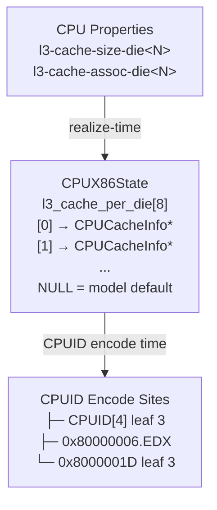

# Architecture: Per-Die Asymmetric L3 Cache

## Data Flow

Per-die L3 overrides are stored separately from the model's uniform `cache_info`. At CPUID encode, the vCPU's die ID is extracted from its APIC ID (`x86_topo_ids_from_apicid`) to select the correct L3 info. This design minimizes blast radius — only 3 CPUID encode sites need modification.

## Design Principles

- **Minimal blast radius**: Only 3 CPUID encode sites modified
- **Fallback model default**: Dies without per-die override use uniform L3 from model definition
- **Separate storage**: Per-die overrides stored in `CPUX86State.l3_cache_per_die[]`, separate from `cache_info`
- **Realize-time initialization**: Per-die structs constructed during `x86_cpu_realizefn()`

## See Also

- [ADR-0001](../adr/0001-per-die-asymmetric-l3-cache.md) — architecture decision record with trade-offs
- [AMD Die Topology](amd-die-topology.md) — background on AMD die/CCD topology
- [CPUID Cache Encoding](cpuid-cache-encoding.md) — CPUID leaf encoding details
- [Glossary](../reference/glossary.md) — Domain terminology
