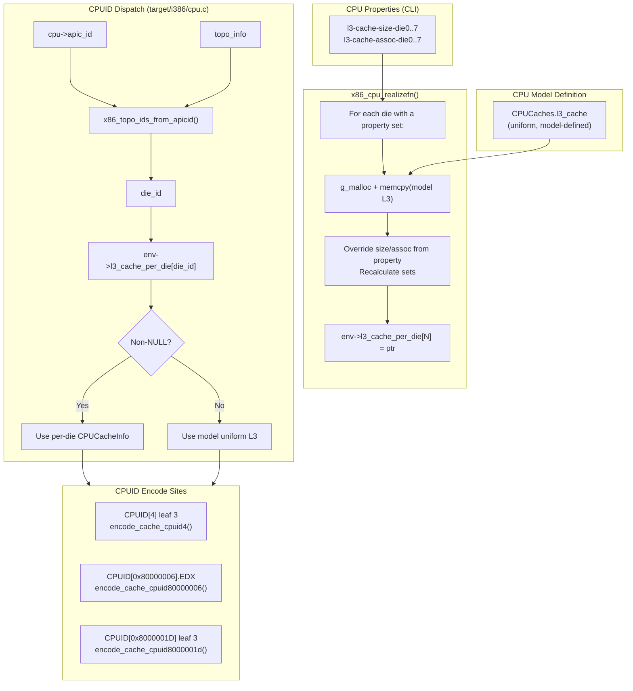

# CPUID Cache Topology Encoding — Per-Die L3 Design

## Overview

QEMU reports cache information to x86 guests through multiple CPUID leaves.
The guest OS queries these leaves during boot to discover the cache hierarchy
— size, associativity, line size, sharing topology — and uses that
information to optimize scheduling, page coloring, and NUMA decisions.

In a standard QEMU CPU model, the cache topology is **uniform**: every
vCPU sees the same L3 parameters from the model definition. The per-die
asymmetric L3 patches break that uniformity by letting each die within a
package report different L3 cache geometry. This document explains how
QEMU's CPUID cache encoding works and how the patches modify it.

All relevant source lives in `target/i386/cpu.c` and `target/i386/cpu.h`.

---

## QEMU's Cache CPUID Architecture

QEMU maintains cache descriptions as `CPUCacheInfo` structs (defined in
`target/i386/cpu.h`). Each CPU model carries a `CPUCaches` struct
(`cache_info` on `CPUX86State`) that holds pointers to L1, L2, and L3
`CPUCacheInfo` objects. These are populated from the model definition
at realize time.

At CPUID dispatch time, the appropriate `CPUCacheInfo` is passed to one
of three `encode_cache_cpuid*()` functions that fill the `EAX`, `EBX`,
`ECX`, `EDX` registers the guest sees:

| Encode function | Used by leaf | Cache level |
|---|---|---|
| `encode_cache_cpuid4()` | CPUID[4] (Intel-style) | Any (L1–L3) |
| `encode_cache_cpuid80000006()` | CPUID[0x80000006].EDX | L2 + L3 combined |
| `encode_cache_cpuid8000001d()` | CPUID[0x8000001D] (AMD extended) | Any (L1–L3) |

When `host-cache-info=on` (passthrough mode), all three sites redirect to
`x86_cpu_get_cache_cpuid()` which reads real hardware CPUID directly,
bypassing QEMU's model cache entirely.

---

## The Three L3 CPUID Encode Sites

Three separate CPUID leaves can report L3 cache information. The guest
kernel (or its firmware) may use any or all of them. Modern Linux prefers
CPUID[0x8000001D] on AMD and CPUID[4] on Intel, but older kernels or
specific code paths may fall back to the legacy leaves. To guarantee
per-die L3 correctness, **all three** must report the correct values for
the vCPU's die.

### CPUID[0x8000001D] leaf 3 — AMD Extended Cache Topology (preferred by modern Linux)

This is the primary cache topology leaf on modern AMD systems. It follows
the same "cache EAX/EBX/ECX/EDX" format as Intel's CPUID[4] but under the
0x8000001D function. Linux uses it for AMD CPU cache enumeration since
kernel ~4.x. The leaf encodes one cache level per sub-leaf (`count`);
sub-leaf 3 is L3.

In `cpu.c`, the handler at `case 0x8000001D:` iterates by `count`. When
`count == 3`, it calls `encode_cache_cpuid8000001d()` with the L3
`CPUCacheInfo` from `env->cache_info.l3_cache`.

### CPUID[0x80000006].EDX — Legacy AMD L3 Info

A single 32-bit register (`EDX`) that encodes L3 geometry in a packed
format: size in 512 KiB increments in bits 31–18, associativity in
bits 15–12, lines-per-tag in bits 11–8, and line size in bits 7–0.
Older Linux kernels and some boot code use this leaf. It reports only
one cache level, so it cannot express per-die differences on its own.

The handler encodes both L2 and L3 into a single output: EAX/EBX/ECX
carry L2 TLB info, while EDX carries both L2 cache info (high nibble of
associativity field) and L3 cache info (size, low associativity, line
size). The function `encode_cache_cpuid80000006()` receives both the L2
and L3 `CPUCacheInfo` pointers.

### CPUID[4] leaf 3 — Intel-Compatible Cache Info

The Intel-format cache leaf uses `EAX`, `EBX`, `ECX`, `EDX` with fields
for cache type, level, associativity, line size, sets, sharing topology,
and self-invalidation behaviour. QEMU implements it primarily for KVM
guests that may use Intel-type CPUID enumeration even on AMD hosts
(common with `-cpu host` on AMD hardware). The handler at `case 4:`
iterates by `count`; `count == 3` is L3.

---

## How Per-Die Selection Works

The selection logic follows the same pattern at all three encode sites:

```
APIC ID → x86_topo_ids_from_apicid() → die_id → l3_cache_per_die[die_id] → use if non-NULL
                                                                           ↓
                                                                    fall back to model default
```

At each encode site, before calling the encode function, the patch
inserts:

```c
X86CPUTopoIDs topo_ids;
CPUCacheInfo *l3;
x86_topo_ids_from_apicid(cpu->apic_id, topo_info, &topo_ids);
l3 = env->l3_cache_per_die[topo_ids.die_id] ?: caches->l3_cache;
```

The `l3` pointer is then passed to the encode function instead of the
model uniform `caches->l3_cache`. If no per-die override exists for
that die (the array slot is NULL), the ternary operator falls back to the
model default — exactly the original behaviour.

### The `x86_topo_ids_from_apicid()` Function

Defined in `target/i386/cpu.c` (upstream QEMU). It decomposes a vCPU's
APIC ID into topology components based on the topology mask configured
in `X86CPUTopoInfo`:

```c
void x86_topo_ids_from_apicid(apic_id, topo_info, topo_ids);
```

- **Input**: vCPU APIC ID (`cpu->apic_id`), topology description
  (`topo_info`, which encodes bits-per-socket, bits-per-die,
  bits-per-core, etc.)
- **Output**: `X86CPUTopoIDs` struct with fields `pkg_id`, `die_id`,
  `module_id`, `core_id`, `smtsibling_id`
- **Relevance**: The `die_id` field indexes into
  `env->l3_cache_per_die[MAX_DIES]`. This is how the patches map a vCPU
  to its die's L3 cache override.

APIC ID topology decoding depends on the CPUID[0x80000026] leaf being
enabled (see patches 0001–0002). Without die topology awareness, every
vCPU gets `die_id = 0` and per-die selection collapses to uniform.

### The Per-Die Storage Array

`CPUX86State.l3_cache_per_die[MAX_DIES]` is an array of 8 pointers (see
`target/i386/cpu.h`). At realize time, for each die with a configured
property, a `CPUCacheInfo` is heap-allocated, cloned from the model's L3
(or from hardcoded Zen5 defaults in passthrough mode), overridden with
property values, and stored in the array. Dies without properties remain
NULL.

### Dataflow Diagram



---

## Passthrough Mode (`host-cache-info=on`)

When `host-cache-info=on` (i.e., `-cpu host`), the normal model-based
cache path is bypassed. Instead, `x86_cpu_get_cache_cpuid()` is called
to read the real hardware's CPUID output and forward it directly to the
guest.

The per-die patches add a **pre-check** before the passthrough fallback:

1. Check if this is an L3 sub-leaf (`count == 3` for CPUID[4] and
   0x8000001D; the entire 0x80000006.EDX for the legacy leaf)
2. If yes, extract `die_id` and look up `l3_cache_per_die[die_id]`
3. If a per-die override exists, call the appropriate
   `encode_cache_cpuid*()` with the override — **skipping** the host
   passthrough
4. If no override exists, fall through to
   `x86_cpu_get_cache_cpuid()` as before

This means per-die L3 properties work in passthrough mode for the dies
that have overrides. Dies without overrides see real hardware values
unchanged.

For the legacy CPUID[0x80000006].EDX leaf, the passthrough logic is
slightly different: it calls `x86_cpu_get_cache_cpuid()` first to get
the host's L2 TLB/L2 cache (which must not be overridden), then **only
overrides EDX** with the per-die L3 encoding. This preserves the host's
L2 cache information while substituting L3.

---

## What Each Patch Changes

### Patch 0006 — Per-Die L3 Foundation (`target/i386/cpu.h`, `target/i386/cpu.c`)

- Adds `MAX_DIES` (8) and `l3_cache_per_die[MAX_DIES]` pointer array on
  `CPUX86State`
- Adds CPU properties `l3-cache-size-die<N>` (uint32) and
  `l3-cache-assoc-die<N>` (uint8) for N=0..7
- Adds realize-time initialization block in `x86_cpu_realizefn()`:
  iterates dies, clones model L3 or hardcoded Zen5 defaults, overrides
  size/associativity from properties, recalculates `sets`
- Adds validation: error if l3-cache=off + per-die props; warning if
  die index ≥ topology die count
- Adds `x86_cpu_finalizefn()` to free per-die `CPUCacheInfo` structs
  (`g_free`) and wires it into `instance_finalize`
- **No CPUID encode changes** — no guest-visible effect

### Patch 0007 — Per-Die L3 CPUID Encode (`target/i386/cpu.c`)

- Modifies CPUID[4] leaf 3 handler: extracts `die_id`, selects
  `l3_cache_per_die[die_id] ?: caches->l3_cache`, passes to
  `encode_cache_cpuid4()`
- Modifies CPUID[0x80000006] handler: same pattern, passes L3 pointer to
  `encode_cache_cpuid80000006()`
- Modifies CPUID[0x8000001D] leaf 3 handler: same pattern, passes L3
  pointer to `encode_cache_cpuid8000001d()`
- Model mode only; passthrough mode unchanged (still uses
  `x86_cpu_get_cache_cpuid()`)

### Patch 0008 — Per-Die L3 Passthrough Mode (`target/i386/cpu.c`)

- Adds passthrough pre-check at CPUID[4] leaf 3: if per-die override
  exists, call `encode_cache_cpuid4()` directly instead of
  `x86_cpu_get_cache_cpuid()`
- Adds passthrough pre-check at CPUID[0x8000001D] leaf 3: same pattern
  with `encode_cache_cpuid8000001d()`
- Adds passthrough handling at CPUID[0x80000006]: calls
  `x86_cpu_get_cache_cpuid()` for host TLB/L2, then overrides EDX with
  per-die L3 encoding if an override exists
- Dies without overrides behave identically to unpatched passthrough

---

## Key Files

| File | Role |
|---|---|
| `target/i386/cpu.h` | `CPUX86State` struct, `l3_cache_per_die[]` array, `MAX_DIES` |
| `target/i386/cpu.c` | All CPUID dispatch, cache encode functions, realize/finalize, properties |
| `patches/0006-per-die-l3-cache.patch` | Foundation: storage, properties, realize |
| `patches/0007-per-die-l3-cpuid-encode.patch` | Model-mode CPUID encode changes |
| `patches/0008-per-die-l3-passthrough.patch` | Passthrough-mode CPUID encode changes |
