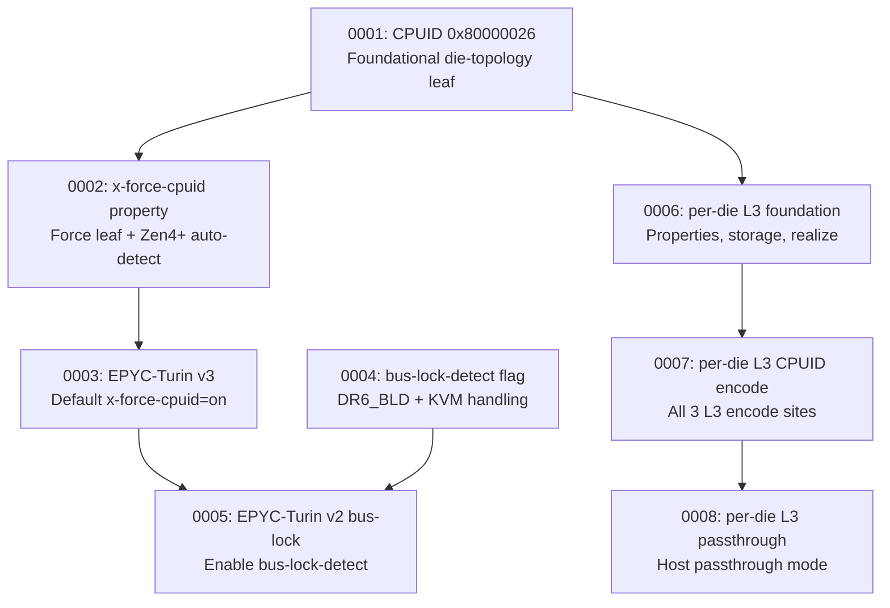

# Patch Dependencies & Interactions

Reference quadrant — describes dependencies, ordering rationale, and interactions between DKVM QEMU patches.

## Dependency Graph



Two independent feature branches diverge from `0001`:
- **Bus-lock-detect** (0004 → 0005) — independent feature touching same files
- **Per-die L3 cache** (0006 → 0007 → 0008) — primary feature of this patchset

## Why This Order?

Patches are sorted for **correct build semantics** and **minimum conflict risk**:

| Priority | Reason |
|----------|--------|
| 0001 first | All die-topology patches depend on CPUID[0x80000026]. Without this leaf, `die_id` extraction and topology queries fail at runtime. |
| 0002 next | Needs 0001's CPUID handler to expose the leaf. Adds the property + auto-detect. |
| 0003 next | References `x-force-cpuid-0x80000026` property from 0002. Would fail to apply before 0002. |
| 0004 (parallel) | Independent of 0001-0003. Placed early to establish KVM debug flag before 0005 uses it. |
| 0005 | Requires EPYC-Turin version definitions (0003). 0004 (DR6_BLD) needed at runtime for full KVM integration but no build dep — they touch different files. |
| 0006 | Uses die topology from 0001 (`topo_info.dies_per_pkg`). Requires 0001's topology infrastructure. |
| 0007 | References `l3_cache_per_die[]` storage defined in 0006. |
| 0008 | Builds on 0007's CPUID encode infrastructure. Adds passthrough paths at same encode sites. |

## Can Patches Be Applied Individually?

| Patch | Independently Useful? | Notes |
|-------|----------------------|-------|
| 0001 | **Yes** | CPUID[0x80000026] is a standard AMD leaf. Exposes die/module topology to guests independently. |
| 0002 | **Yes** | Property works with any model, not just EPYC-Turin. Auto-detect works for all Zen4+ CPUs. |
| 0003 | **No** | Only adds convenience defaults. Requires 0002 for the property it enables. EPYC-Turin v1 works without it. |
| 0004 | **Yes** | Bus-lock debug exception is a standalone KVM feature, independent of all other patches. |
| 0005 | **No** | Just enables `bus-lock-detect=on` on EPYC-Turin v2. Requires 0003 (version definitions). 0004 needed at runtime for KVM DR6_BLD handling, no build dep. |
| 0006 | **No** | Adds properties and storage but no CPUID changes — no guest-visible effect. Requires 0001 for die topology validation. |
| 0007 | **No** | CPUID encode changes need `l3_cache_per_die[]` from 0006. Without 0006, references to `env->l3_cache_per_die` won't compile. |
| 0008 | **No** | Passthrough support depends on per-die infrastructure from 0007 and encode sites it modified. |

## Interactions

### File Overlap

| Patch | Files Touched | Overlaps With |
|-------|--------------|---------------|
| 0001 | `cpu.c`, `kvm/kvm.c` | 0002, 0003, 0005, 0006, 0007, 0008 (cpu.c); 0004 (kvm.c) |
| 0002 | `cpu.c`, `cpu.h` | 0001, 0003, 0005, 0006, 0007, 0008 (cpu.c); 0004, 0006 (cpu.h) |
| 0003 | `cpu.c` | all cpu.c patches |
| 0004 | `cpu.h`, `kvm/kvm.c` | 0002, 0006 (cpu.h); 0001 (kvm.c) |
| 0005 | `cpu.c` | all cpu.c patches |
| 0006 | `cpu.h`, `cpu.c` | 0002, 0004 (cpu.h); all cpu.c patches |
| 0007 | `cpu.c` | all cpu.c patches |
| 0008 | `cpu.c` | all cpu.c patches |

### Specific Interaction Risks

**Bus-lock-detect vs. per-die L3** — independent features, same files:
- Both touch `kvm/kvm.c` (0001 + 0004) but modify different functions — no logical conflict.
- 0004 adds `DR6_BLD` define in `cpu.h`; 0006 adds per-die fields in same header — no overlap of lines.
- No functional interaction: bus-lock detection and cache topology are orthogonal.

**0005 vs. 0006-0008 in cpu.c** — 0005 modifies the EPYC-Turin version 2 definition block (`.versions` array). 0006-0008 add properties, realize code, and CPUID encode logic. These touch unrelated regions of cpu.c. No conflict.

**0004 vs. 0006 in cpu.h** — 0004 adds a single `#define DR6_BLD` near existing debug register defines. 0006 adds struct fields in `CPUX86State` and `X86CPU`. Different sections, no overlap.

## What Breaks If Order Changes

| Swapped Order | Effect |
|---------------|--------|
| 0002 before 0001 | Patch applies cleanly (adds property + auto-detect), but at runtime CPUID[0x80000026] has no handler → guest sees zeroes. Feature silently broken. |
| 0003 before 0002 | **Patch fails.** `x-force-cpuid-0x80000026` property not yet defined. Context lines may mismatch. |
| 0005 before 0003 | **Patch fails or corrupts.** EPYC-Turin version definitions don't exist yet. The @@-hunk targets a region that doesn't have the `.versions` array. |
| 0005 before 0004 | **Applies cleanly** (no code-level dep). But runtime: bus-lock-detect CPU feature on, yet KVM lacks DR6_BLD handling (0004) → bus-lock debug exceptions not forwarded. |
| 0006 before 0001 | **Runtime bug.** `env->topo_info.dies_per_pkg` is 0 or bogus without 0001's topology setup. Per-die validation (die ≥ dies_per_pkg) incorrectly warns on all valid configs. |
| 0007 before 0006 | **Compile error.** `env->l3_cache_per_die` is undeclared. |
| 0008 before 0007 | **Compile error.** References `l3_cache_per_die` and encode functions added by 0007. Context lines in cpu.c CPUID switch won't match. |
| 0004 anywhere after 0005 | **Both orders work.** 0004 (cpu.h + kvm/kvm.c) and 0005 (cpu.c) touch disjoint code — no build conflict. |

### Summary of hard ordering constraints (patches that must precede):

```
0001 → 0002, 0006
0002 → 0003
0003 → 0005
0004 → 0005 (runtime, not build)
0006 → 0007 → 0008
```

## Patch Table

| # | File(s) | Predecessors | Independently Useful? | Interactions |
|---|---------|-------------|----------------------|--------------|
| 0001 | `cpu.c`, `kvm/kvm.c` | none (foundational) | Yes | All later patches depend on this. Introduces `encode_topo_cpuid80000026()` and KVM passthrough loop. |
| 0002 | `cpu.c`, `cpu.h` | 0001 | Yes | Adds property + auto-detect in `x86_cpu_expand_features()`. Adds `x86_is_amd_zen4_or_above()` inline. |
| 0003 | `cpu.c` | 0002 | No | Adds EPYC-Turin v2/v3 version entries in `builtin_x86_defs[]`. Baseline for 0005. |
| 0004 | `cpu.h`, `kvm/kvm.c` | none | Yes | Defines `DR6_BLD`, modifies `kvm_handle_debug()`. No relation to cache/topology patches. |
| 0005 | `cpu.c` | 0003 (build), 0004 (runtime) | No | Adds `"bus-lock-detect", "on"` to EPYC-Turin v2 props. Tiny change. |
| 0006 | `cpu.h`, `cpu.c` | 0001 | No | Adds `l3_cache_per_die[]`, properties, realize init, finalize. Largest patch. Adds `instance_finalize` to `X86CPU`. |
| 0007 | `cpu.c` | 0006 | No | Modifies 3 CPUID encode sites. No new types or properties. |
| 0008 | `cpu.c` | 0007 | No | Adds passthrough branches at the same 3 encode sites. Depends on 0007's per-die selection pattern. |
